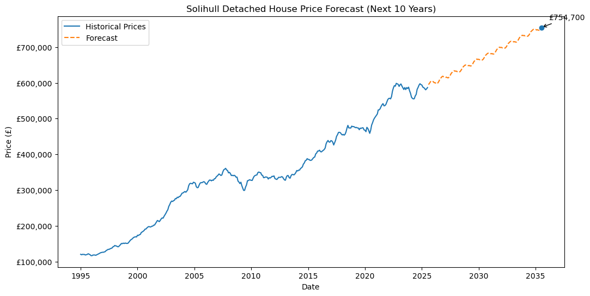

# Forecasting the Detached House Prices in Solihull

## Project Overview

This project develops a time series forecasting model to predict **average detached house prices in Solihull** over the next 10 years using UK government housing data between 1995 and 2025.

## Creating Hypothesis

* **Null Hypothesis:** Detached house prices in Solihull will not show sustained growth over the next 10 years.
* **Alternative Hypothesis:** Detached house prices in Solihull will consistently grow over the next 10 years.


## Tools & Environments used

* Python
* Jupyter Notebook
* statsmodels

### libraries that were used

```python
import pandas as pd
import numpy as np
import matplotlib.pyplot as plt
import seaborn as sns
from statsmodels.tsa.stattools import adfuller
from statsmodels.tsa.statespace.sarimax import SARIMAX
```


## Data Engineering & Preparation

The dataset was sourced from UK government statistics based on HM Land Registry data. 
It contains average house prices by property type from 1995 to 2025 for areas across the united kingdom.

### Loading the Dataset in

```python
df = pd.read_csv("Average-prices-Property-Type-2025-07.csv")

print("Data loaded successfully.\n")
print(df.head())
```

###Dataset Preview


*Figure 1: Dataset after being loaded in

### Data Cleaning

```python
# remove extra spaces from column names
df.columns = df.columns.str.strip()

# convert Date column to datetime format
df['Date'] = pd.to_datetime(df['Date'])
```

Key steps:

* Cleaned column names
* Converted dates for time series analysis


### Handling Missing Values

```python
df.isnull().sum()
```

Missing values were checked and removed where necessary to ensure data quality.


### Creating Solihull Subset

```python
solihull_df = df[df['Area'] == 'Solihull']
```

The dataset was filtered to focus specifically on Solihull.

### Hisotirc data Visualisation

The following code plots the historical trend of detached house prices in Solihull over time.

```python
# create a canvas for the time series graph
plt.figure(figsize=(10, 5))

# plot the detached house price time series
plt.plot(ts)

# add title and axis labels
plt.title("Solihull Detached House Prices Over Time")
plt.xlabel("Date")
plt.ylabel("Price")

# adjust layout to prevent overlap
plt.tight_layout()

# display the plot
plt.show()


## Time Series Modelling (SARIMA)

A **SARIMA model** was used due to its ability to capture both trend and seasonal patterns in time series data.


### Stationarity Check (ADF Test)

```python
result = adfuller(solihull_df['Detached_Price'])
print('ADF Statistic:', result[0])
print('p-value:', result[1])
```

The Augmented Dickey-Fuller test was used to confirm whether the data is stationary.


### Building the SARIMA Model

```python
model = SARIMAX(solihull_df['Detached_Price'],
                order=(p,d,q),
                seasonal_order=(P,D,Q,s))

results = model.fit()
```


SARIMA was chosen over ARIMA because it accounts for seasonal variation in housing data.


## Forecasting and Visualisations

```python
forecast = results.get_forecast(steps=120)
forecast_values = forecast.predicted_mean

plt.figure(figsize=(10,5))
plt.plot(solihull_df['Date'], solihull_df['Detached_Price'], label='Historical Data')
plt.plot(forecast_values, label='Forecast', color='orange')
plt.legend()
plt.show()
```

### Forecast Output



*Figure 2: SARIMA forecast showing predicted growth in detached house prices*


## Results

* The model predicts **consistent growth** in detached house prices
* Estimated average price by **2035: ~£754,700**
* Seasonal fluctuations exist, but long-term growth dominates


## Conclusion

The results support rejecting the null hypothesis and accepting the alternative:

Detached house prices in Solihull are expected to **grow consistently over the next 10 years**.


## Data Ethics

* Data is publicly available and aggregated
* No personal or sensitive data used
* Source verified via HM Land Registry
* Approach aligned with UK Government Data Ethics Framework


## Evaluation and Improvements

Future improvements could include:

* Comparing multiple models (e.g. Holt-Winters)
* Incorporating external variables such as:

  * Interest rates
  * Inflation
* Improving model accuracy through additional features

